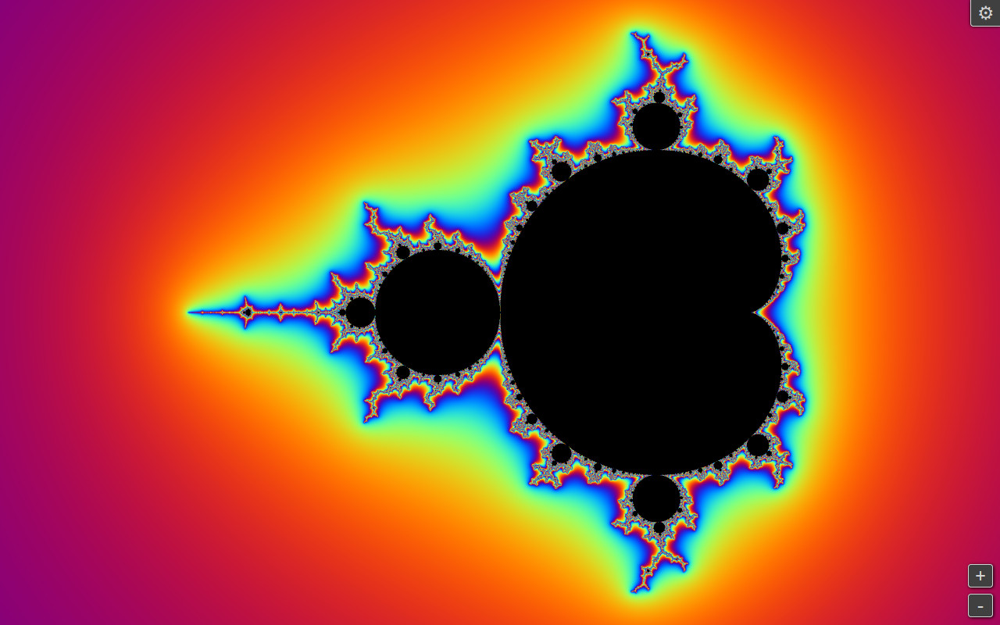
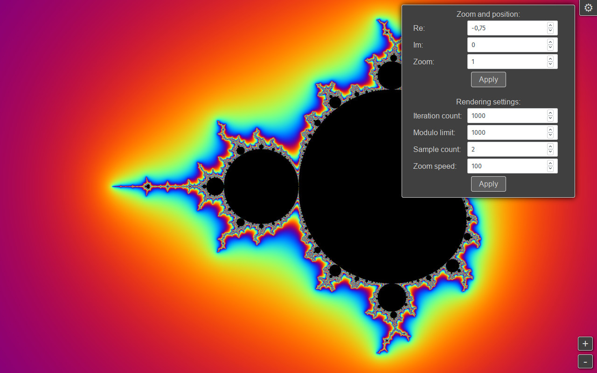
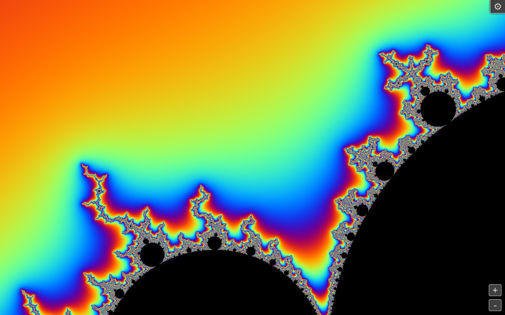

# mandelbrot

An interactive [Mandelbrot set](https://en.wikipedia.org/wiki/Mandelbrot_set)
plotting/rendering application using the simple escape time algorithm.

To run this application, you will need a browser with support for
JavaScript (ES10 or later), CSS 3 and HTML Canvas.

Usage:
------

To launch the renderer, just open `index.html` in your browser.

Dragging with the left mouse button will move the image.

To zoom in/out, use the scroll wheel or the zoom buttons in the lower right corner.

Clicking the cog icon will open the settings menu.
Zoom, position and other rendering settings can be adjusted there.

Screenshots:
------------

License:
--------

[MIT License](https://opensource.org/licenses/MIT)
